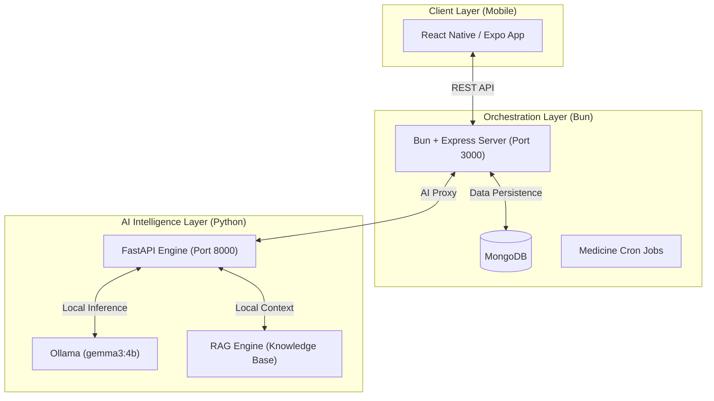

# Care+ — AI-Powered Personal Health Companion

[](https://github.com/stha-sanket/Ai_Hackathon_2026_Team_Incognito)
[](#tech-stack)
[](#contributors)

> **Empowering Independence through Local Intelligence.** Care+ is a state-of-the-art health monitoring application designed for elderly care, combining private conversational AI with proactive health management tools.

---

## 🌟 Features

### 🎙️ AI Chat Companion (Multi-lingual)
A friendly, high-performance chatbot that communicates fluently in both **English and Nepali**. It answers health queries, manages daily tasks, and holds natural conversations — all processed locally via `gemma3:4b`.

### 💊 Proactive Medicine Management
A comprehensive CRUD system for medications. The **Bun Orchestrator** handles schedules and fires **Push Notifications** via server-side Cron jobs, ensuring users never miss a dose.

### 🔍 intelligent Object Tracking
Uses AI intent detection to help users remember where they placed their belongings (e.g., *"Where are my glasses?"*). The system parses natural language to save and retrieve locations instantly.

### 🧠 Mood Analysis & Sentiment Trends
Passive sentiment analysis periodically evaluates chat history to monitor emotional well-being. Trends are analyzed locally, providing insights into a user's mental health without compromising privacy.

### 📄 AI-Generated Health Reports
Converts complex chat history and health data into structured, professional summaries. These reports are designed to be shared with family members or healthcare professionals.

---

## 🏗️ Architecture Overview

Care+ utilizes a **Federated Microservice Architecture** to separate UI, Business Logic, and Heavy AI Processing.



### The Three Tiers
1.  **Mobile Client (React Native)**: Handles the premium interface, voice input (TTS/STT), and notification display.
2.  **Orchestrator (Bun Backend)**: The "Management" layer. Handles authentication, stores data in **MongoDB**, and manages automated medicine reminders.
3.  **AI Engine (FastAPI)**: The "Brain". Handles multi-lingual intent routing, RAG (Retrieval-Augmented Generation), and report distillation using locally hosted LLMs.

---

## 💻 Tech Stack

| Layer | Technology | Usage |
| :--- | :--- | :--- |
| **Frontend** | React Native (Expo) | Cross-platform UI, NativeWind, Notifications |
| **Orchestrator** | Bun + Express | High-speed API Gateway, MongoDB, Cron Jobs |
| **AI Engine** | FastAPI (Python) | Intent Classification, RAG, Nepali Detection |
| **Local LLM** | Ollama (`gemma3:4b`) | Private, local-first inference engine |
| **Databases** | MongoDB | Persistent storage for users/chat/meds |

---

## 📂 Project Structure

```text
care-plus/
├── application/          # React Native / Expo Mobile App
│   ├── app/              # Expo Router screens (Tabs, Auth)
│   ├── services/         # API & Notification services
│   └── components/       # Custom UI components
│
├── server1/              # Bun + Express Orchestrator (Port 3000)
│   ├── src/
│   │   ├── llm/          # Proxy logic for AI Engine
│   │   ├── medicine/     # Medicine CRUD & Business Logic
│   │   └── cron/         # Push notification schedules
│
└── app/                  # FastAPI AI Middleware (Port 8000)
    ├── services/         # LLM, RAG, Intent, and Agent logic
    ├── data/kb/          # Verified health knowledge base
    └── main.py           # Engine entry point
```

---

## 🚀 Getting Started

### Prerequisites
- **Ollama**: [Download & Install](https://ollama.com/)
- **Bun**: `curl -fsSL https://bun.sh/install | bash`
- **Node.js**: v18+
- **Python**: 3.10+
- **MongoDB**: Local instance running on port 27017

### Initialization
1.  **Pull the Model**:
    ```bash
    ollama pull gemma3:4b
    ```
2.  **Install Dependencies**:
    ```bash
    # Bun Server
    cd server1 && bun install

    # AI Engine
    cd ../app && pip install -r requirements.txt

    # Mobile App
    cd ../application && npm install
    ```

---

## 🚦 Running the Project

Open three terminal windows (or use a task runner):

1. **AI Brain** (Port 8000)
   ```bash
   cd app && python -m uvicorn main:app --reload
   ```
2. **Orchestrator** (Port 3000)
   ```bash
   cd server1 && bun dev
   ```
3. **App Client**
   ```bash
   cd application && npx expo start
   ```

---

## 👥 Contributors

This project was developed with passion by **Team Incognito**:

- **Sanket Shrestha** · [stha-sanket](https://github.com/stha-sanket)
- **Prashanta Adhikari** · [pr4shxnt](https://github.com/pr4shxnt)
- **Shreya Khadka**
- **Sabitra Pachai**

---

## 📄 License

Care+ is a prototype developed for AI Hackathon 2026. All rights reserved by **Team Incognito**.
